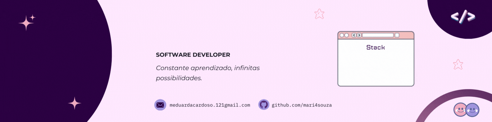

  

#

  Atualmente curso Técnico em Informática para Internet na Escola Estadual Protásio Alves (jul/2024 – dez/2025), com foco no desenvolvimento, manutenção e gerenciamento de sites e aplicações web. Estou aprendendo a atuar tanto no frontend quanto no backend, com atenção à performance, segurança e boas práticas de desenvolvimento.
    
  Entre as habilidades desenvolvidas estão: planejamento e documentação de sistemas, codificação para web e dispositivos móveis, estruturação de bancos de dados, publicação, testes e manutenção de aplicações.

#

<h3 align="center">Connect with me!</h3>

  
  
  

<h3 align="center">My Stack ~</h3>

  
  
  
  
  
  
  
  
  

#

  <h3>✨ GitHub Stats ✨</h3>
  
  

    

  

    

  

#

  <picture>
    <source media="(prefers-color-scheme: dark)" srcset="https://raw.githubusercontent.com/oscarsevero/oscarsevero/output/github-contribution-grid-snake-dark.svg">
    <source media="(prefers-color-scheme: light)" srcset="https://raw.githubusercontent.com/oscarsevero/oscarsevero/output/github-contribution-grid-snake.svg">
    
  </picture>

